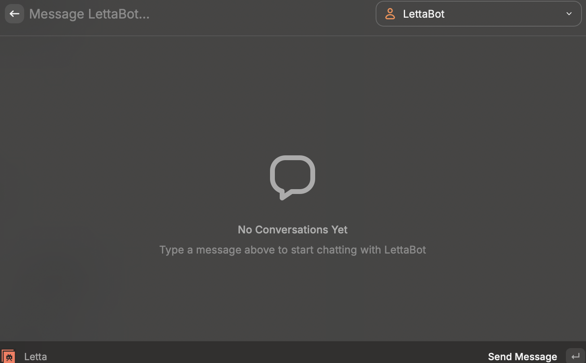
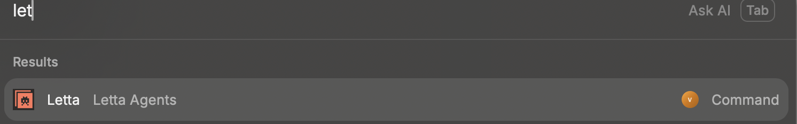

# Letta Agents for Raycast

Chat with your stateful AI agents that remember and learn over time — directly from Raycast.




## Features

- **🧠 Chat with Agent**: Talk to Letta agents that remember context across conversations
- **👥 Manage Agents**: List and switch between your agents
- **📝 View Memory**: Inspect what your agent knows and remembers about you

## Commands

| Command | Description |
|---------|-------------|
| **Chat with Agent** | Send messages to your active Letta agent |
| **Manage Agents** | List, select, and manage your agents |
| **View Agent Memory** | Inspect memory blocks of the active agent |

## Setup

1. Install the extension from Raycast Store
2. Get your Letta API key from [app.letta.com](https://app.letta.com)
3. Open Raycast Preferences → Extensions → Letta
4. Enter your API key
5. (Optional) Set a custom base URL for self-hosted Letta

## Configuration

| Preference | Description | Required |
|------------|-------------|----------|
| **API Key** | Your Letta API key | Yes |
| **Base URL** | Custom Letta API URL for self-hosted | No |
| **Show Reasoning** | Display agent's internal thoughts | No |

## Development

```bash
# Install dependencies
npm install

# Start development
npm run dev

# Build for production
npm run build

# Lint
npm run lint
```

## Architecture

```
src/
├── hooks/
│   ├── useLettaClient.ts   # Letta client initialization
│   ├── useAgents.ts        # Agent list + active selection
│   ├── useChat.ts          # Chat message handling
│   └── index.ts            # Barrel exports
├── chat.tsx                # Chat command
├── agents.tsx              # Agent management command
└── memory.tsx              # Memory inspection command
```

## Links

- [Letta Documentation](https://docs.letta.com)
- [Letta ADE](https://app.letta.com)
- [Raycast Extensions](https://developers.raycast.com)

## License

MIT
